# 昀音频采集所有权与唤醒状态机

## 物理麦克风规则

任一时刻只有一个 `Physical Capture Owner`：`native`、`browser` 或 `none`。`AudioCaptureManager.start()` 在 owner 为 native 时拒绝打开 Chromium 麦克风；`usePersistentAudioCapture` 只订阅指标，不启动采集。浏览器 barge-in 共享备用模式已经打开的 `AudioCaptureManager`；原生采集有效时，浏览器 barge-in 不挂载。

```mermaid
stateDiagram-v2
  [*] --> starting
  starting --> native_active: sidecar health OK / native mic running
  starting --> browser_fallback: native unavailable; native stop confirmed; browser getUserMedia succeeds
  starting --> fallback_pending: startup handoff requested
  native_active --> native_reconnecting: WebSocket closed
  native_reconnecting --> native_active: WebSocket restored
  native_reconnecting --> fallback_pending: 3 reconnect attempts exhausted
  fallback_pending --> browser_fallback: native mic release confirmed; browser capture starts
  fallback_pending --> native_stop_unconfirmed: native release cannot be confirmed
  browser_fallback --> handover_back_to_native: every 15 s, native health recovers
  handover_back_to_native --> native_active: browser owner released; native start confirmed
  handover_back_to_native --> browser_fallback: native recovery fails; browser capture restarts
  native_active --> off: wake disabled; native stop requested
  browser_fallback --> off: wake disabled; browser stream released
```

切换时先向 sidecar 请求释放硬件，再释放/取得 browser owner。sidecar 未确认释放时不启动 browser capture，并显示 `native-stop-unconfirmed`，避免以双采集换取表面上的“正在监听”。Native 恢复探测每 15 秒执行；接管期间先取消 browser listener、将共享采集器 owner 置为 none，再启动 native。

## 音频处理与诊断

- Native 正常时由 sidecar 采集、执行唤醒和语音处理；renderer 消费 WebSocket 事件。TTS 时原生监听保持开启，由原生 AEC 处理播放回声。
- Browser fallback 使用唯一的 `AudioCaptureManager` stream；AudioContext 单声道输入、1024 sample processor frame、环形队列最多 96 帧，超出时丢弃最旧帧并计数。浏览器 AEC 使用共享 TTS speaker reference。
- Browser VAD 启动阈值 RMS `0.012`，静音阈值 `0.006`，连续 3 帧静音后结束分段；最多回看 0.45 秒、采集 3 秒语音，保留的滚动缓冲上限 6 秒；唤醒冷却 3.5 秒。
- Browser fallback 把同一段音频并行送给 wake 检测与 ASR，再以识别文本作漏检交叉核验。新唤醒与命令不再打开第二条录音。
- 设置面板显示来源、owner、采样率、帧长、队列深度、丢帧、VAD RMS、wake score/confidence、漏检交叉核验、误唤醒/有效唤醒人工标记、冷却抑制、TTS 活跃监听帧、命令抑制帧和 native 重试次数。

## 状态码与排查边界

`native-listening`、`native-reconnecting`、`fallback-pending`、`browser-fallback`、`native-recovering`、`native-stop-unconfirmed`、`browser-fallback-denied` 和 `off` 对应 UI 当前状态。fallback 权限问题会显示 denied。

历史对比中，`642790b` 与 `eaae249` 的浏览器阈值、静音帧数、缓冲上限和冷却值相同。因此当前修复没有降低阈值；主要消除 Native 正常时其它 renderer hook 另开 browser capture 的所有权冲突，并让 fallback 中的 barge-in 共用同一物理 stream。Native KWS 模型阈值来自 sidecar 实现；仓库当前未包含其模型源文件，本轮没有改它。

唤醒设置面板的人工标记和 browser “漏唤醒”计数用于定位回归，不等同于自动化真值。是否对真实麦克风有明显改善，仍需在目标电脑上用同一麦克风、扬声器音量和距离做前后对照。
